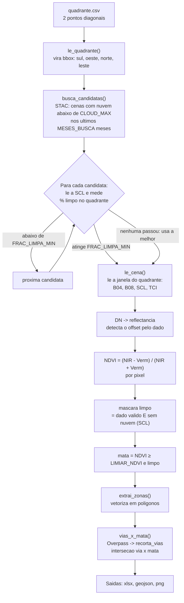
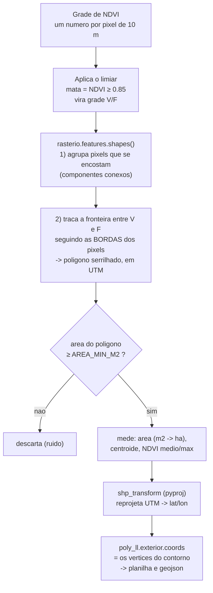

# Documentação — Mapeamento de mata por NDVI (Projeto RPA)

> **Para quem está lendo (humano ou IA):** este documento é autossuficiente. Ele descreve o
> subsistema de vegetação/NDVI do Projeto RPA: o que cada módulo faz, o fluxo passo a passo,
> todos os parâmetros necessários para rodar, os formatos de entrada/saída e as armadilhas
> conhecidas. Com ele é possível explicar, operar e modificar o código sem ler os fontes.

---

## 1. Contexto e objetivo

O Projeto RPA calcula perfis de elevação a pé para estimar o **esforço de instalação de postes**.
Dentro desse projeto:

- `estradas.py` recebe um **quadrante** (retângulo definido por 2 pontos diagonais) e acha as
  **estradas e proto-estradas** dentro dele, via OpenStreetMap.
- `vegetacao.py` (documentado aqui) usa **o mesmo quadrante** e acha as **zonas de mata**
  (vegetação densa) via imagem de satélite, calculando o índice **NDVI**. Além disso, mede
  **quantos metros de cada via passam dentro de mata** — o dado que interessa para o esforço
  de instalação (abrir caminho em mata é mais caro).
- `validacao_vegetacao.py` afere a qualidade do modelo de mata contra uma referência
  independente (ESA WorldCover).

**Toda a stack é gratuita e SEM chave de API** (mesma filosofia do resto do projeto).

### O que é NDVI

NDVI (*Normalized Difference Vegetation Index*) mede vigor de vegetação, de −1 a +1:

```
NDVI = (NIR − Vermelho) / (NIR + Vermelho)
```

A física: a **clorofila absorve a luz vermelha** (usa na fotossíntese), enquanto a estrutura
interna da folha **reflete fortemente o infravermelho próximo (NIR)**. Logo:

| Superfície      | Vermelho | NIR      | NDVI típico |
|-----------------|----------|----------|-------------|
| Mata densa      | ~0.04    | ~0.32    | **0.85–0.91** |
| Pasto/cana      | ~0.08    | ~0.30    | 0.6–0.85    |
| Solo/asfalto    | ~0.20    | ~0.25    | ~0.1        |
| Água            | —        | absorve  | negativo    |

**Limitação conceitual importante:** o NDVI mede *vigor*, não *porte*. Ele não distingue uma
mata alta de um pasto viçoso ou de cana. Por isso o modelo tende a **superestimar mata** em
áreas de pastagem (ver seção 8, Validação).

---

## 2. Módulos e dependências

| Arquivo | Papel |
|---|---|
| `vegetacao.py` | **Principal.** Calcula NDVI, delimita zonas de mata, cruza com vias, gera saídas. |
| `validacao_vegetacao.py` | Valida o modelo de mata contra o ESA WorldCover. |
| `estradas.py` | Reaproveitado: `le_quadrante`, `consulta_overpass`, `extrai_vias`, `recorta_vias`. |
| `urbano.py` | Reaproveitado: `escreve_xlsx_seguro` (grava xlsx tolerando arquivo aberto no Excel). |
| `menu.py` | Menu interativo. Opção **[5]** = vegetação, opção **[6]** = validação. |

### Dependências Python

```
pandas
pyproj
openpyxl
requests
matplotlib
rasterio      <- necessária para o NDVI (leitura de imagem de satélite)
shapely       <- necessária para o NDVI (geometria dos polígonos)
```

Instalação: `pip install -r requirements.txt`
(Testado em Python 3.13 no Windows. `rasterio` traz o GDAL embutido via wheel.)

### Fontes de dados externas (todas gratuitas, sem chave)

| Fonte | Uso | Endpoint |
|---|---|---|
| **Earth Search (STAC)** | catálogo Sentinel-2 L2A | `https://earth-search.aws.element84.com/v1/search` |
| **sentinel-cogs (AWS)** | as imagens (COG) | URLs vêm do STAC; bucket público |
| **Overpass (OSM)** | as vias, via `estradas.py` | espelhos definidos em `estradas.py` |
| **ESA WorldCover** | referência da validação | `https://esa-worldcover.s3.eu-central-1.amazonaws.com` |

**Requer internet.** Não requer cadastro, chave, token nem conta em nenhum serviço.

---

## 3. Entrada: `quadrante.csv`

O **mesmo arquivo** usado pelo `estradas.py`. Define o retângulo de interesse por meio de
**2 pontos diagonais** (a ordem não importa; o quadrante é o retângulo que os contém).

Formato aceito (o separador é detectado automaticamente; vírgula decimal é tolerada):

```csv
latitude,longitude
-6.801427882331544,-35.296721489491894
-6.814505067773674,-35.274417377851925
```

`le_quadrante()` (em `estradas.py`) devolve:
- `bbox = {"sul": min_lat, "oeste": min_lon, "norte": max_lat, "leste": max_lon}`
- `pontos` = a lista dos pontos informados (só para o gráfico)

**Restrição:** os 2 pontos não podem ter a mesma latitude nem a mesma longitude (não formariam
um retângulo). Quadrantes de alguns km funcionam bem; muito grandes ficam lentos (mais pixels).

---

## 4. Fluxograma geral



## 5. Fluxograma do detalhe: de pixel a coordenada

Esta é a etapa `extrai_zonas()` — onde a grade de números vira polígonos com coordenadas.



---

## 6. O processo passo a passo

### Passo 1 — Delimitar o quadrante
`le_quadrante(entrada)` lê o CSV e devolve o `bbox`. Compartilhado com `estradas.py`, o que
garante que a mata seja procurada **exatamente na mesma área** onde as vias foram achadas.

### Passo 2 — Escolher a cena de satélite
`busca_candidatas(bbox)` faz um POST no STAC do Earth Search filtrando por:
- coleção `sentinel-2-l2a`;
- o `bbox`;
- data: dos últimos `MESES_BUSCA` meses até hoje;
- nuvem da cena `< CLOUD_MAX`%.

O resultado é ordenado da **menos** para a **mais** nublada.

`escolhe_cena(bbox, limiar)` então **tria** as candidatas: para cada uma (até `MAX_CANDIDATAS`),
`frac_limpa_scl()` lê **apenas a camada SCL** (20 m — barata) e mede a fração de pixels limpos
*sobre o quadrante*. Para na primeira com `>= FRAC_LIMPA_MIN`. Se nenhuma atingir, usa a melhor.

> **Por que triar assim:** uma cena pode ter só 5% de nuvem no total e mesmo assim ter *uma nuvem
> justo em cima do seu quadrante*. A nuvem global não basta; o que importa é o quadrante.

### Passo 3 — Ler só a janela
`le_cena(item, bbox, limiar)` abre os COGs e lê **apenas os pixels do quadrante**:

| Banda | Conteúdo | Resolução |
|---|---|---|
| `red` (B04) | vermelho | 10 m |
| `nir` (B08) | infravermelho próximo | 10 m |
| `scl` | classificação de cena (nuvem/sombra) | 20 m → reamostrada p/ 10 m |
| `visual` | cor real (TCI), só para o gráfico | 10 m |

`_janela(ds, bbox)` converte o bbox (lat/lon, EPSG:4326) para o **UTM nativo da cena** e calcula
quais linhas/colunas cair dentro. É por isso que é rápido: não baixa o tile inteiro (10980×10980).

### Passo 4 — DN para reflectância (⚠ ver seção 9)
Os pixels vêm como inteiros (DN). Converte-se com `reflectancia = DN * escala + offset`,
onde escala/offset vêm da metadata `raster:bands` — **mas o offset é validado contra o dado**.

### Passo 5 — Calcular o NDVI
`ndvi = (nir_r - red_r) / (nir_r + red_r)` para cada pixel válido. Proteções aplicadas:
- reflectância é pisada em `>= 0` (`np.clip`) — garante NDVI dentro de [−1, 1];
- o denominador precisa ser `> 1e-6` — evita divisão por ~zero em pixels escuros;
- `DN == 0` é "sem dado" e vira inválido.

### Passo 6 — Mascarar nuvem
`limpo = valido & ~nuvem`, onde nuvem = pixel cuja classe SCL está em `SCL_INVALIDA`
`(0, 1, 3, 8, 9, 10, 11)` = sem dado, saturado, sombra de nuvem, nuvem média, nuvem alta,
cirrus, neve.

### Passo 7 — Delimitar a mata
`mata = limpo & (ndvi >= limiar)` → uma grade booleana (Verdadeiro/Falso por pixel).

### Passo 8 — Vetorizar (grade → polígonos)
`extrai_zonas(dados)` usa `rasterio.features.shapes(mata, mask=mata, transform=tr)`, que:
1. agrupa os pixels `True` que **se encostam** (componentes conexos) — cada grupo é uma zona;
2. **traça a fronteira** entre `True` e `False` andando pelas **bordas dos pixels**.

Por isso o contorno é **serrilhado**, em degraus de 10 m: ele acompanha o quadriculado dos
pixels. Isso não é imprecisão — é a resolução real do sensor.

O `transform` (`tr`) é a ponte pixel↔mundo: uma função afim que mapeia `(linha, coluna)` →
`(x, y)` em metros UTM. `tr.c`/`tr.f` = canto superior-esquerdo; `tr.a` = +10 (largura do pixel);
`tr.e` = **−10** (altura; negativa porque as linhas crescem para o sul). Sem ele, sairiam índices
de pixel; com ele, saem metros.

Depois: descarta polígonos com área `< AREA_MIN_M2`; mede área (`poly.area` já dá m² porque UTM
é métrico), centroide e NDVI médio/máx (via `geometry_mask`); e reprojeta UTM → lat/lon com
`pyproj` para gerar as coordenadas de saída.

### Passo 9 — Cruzar com as vias
`vias_x_mata(bbox, zonas, crs)`:
1. une as zonas num só multipolígono (`unary_union`);
2. busca as vias com `consulta_overpass` + `extrai_vias` + `recorta_vias` (tudo do `estradas.py`);
3. converte cada trecho para UTM e faz `LineString.intersection(mata)`;
4. o **comprimento da interseção** = metros daquela via dentro de mata.

Se o Overpass falhar, o cruzamento é omitido com aviso e o resto das saídas é gerado normalmente.

### Passo 10 — Plotar
- `imshow` desenha a matriz de NDVI; `extent` diz onde ela fica em UTM; `BoundaryNorm` +
  `NDVI_BORDAS` mapeia cada NDVI para a cor da **sua faixa** (quantização discreta — evita que
  vegetação média fique com a mesma cor de mata densa).
- Painel 2 mostra a **cor real** (TCI) com as mesmas zonas, para conferência visual.
- O mapa é desenhado em **UTM (metros)**, não em lat/lon: assim não há distorção e as distâncias
  são lidas direto nos eixos.

---

## 7. Parâmetros

### 7.1 Como rodar

```bash
# 1) instalar dependências (uma vez)
pip install -r requirements.txt

# 2) editar quadrante.csv com os 2 pontos diagonais desejados

# 3) rodar
python vegetacao.py              # mapeia a mata
python validacao_vegetacao.py    # valida o modelo
# ou, pelo menu:
python menu.py                   # opção [5] = vegetação, [6] = validação
```

Em ambiente **sem tela** (servidor/CI/script), evite que `plt.show()` trave:

```bash
MPLBACKEND=Agg python -c "import vegetacao; vegetacao.main(mostrar=False)"
```

Ou via API, sobrescrevendo parâmetros sem editar o arquivo:

```python
import vegetacao
resultado = vegetacao.main(
    entrada="quadrante.csv",
    saida="vegetacao.xlsx",
    saida_grafico="vegetacao.png",
    saida_geojson="vegetacao_zonas.geojson",
    plotar=True,
    mostrar=False,     # True abre a janela do matplotlib (trava scripts headless)
    limiar=0.85,       # sobrescreve LIMIAR_NDVI só nesta execução
)
```

### 7.2 Parâmetros de `vegetacao.py`

Ficam no bloco `# ---------- configuracao ----------` no topo do arquivo.

**Os dois que mais importam:**

| Parâmetro | Default | O que faz |
|---|---|---|
| `LIMIAR_NDVI` | `0.85` | **Define o que é "mata".** Pixels com NDVI ≥ este valor entram. Subir → só mata mais fechada (menos área, mais precisão). Descer → inclui mata rala e pasto viçoso (mais área, menos precisão). Faixa útil: 0.75–0.90. |
| `AREA_MIN_M2` | `2000.0` | **Área mínima de uma zona.** Descarta manchas menores (ruído). 1 pixel = 100 m². 2000 m² = 20 px = 0.2 ha. Subir → só os maciços grandes. |

**Efeito medido no quadrante de teste** (para calibrar):

| `LIMIAR_NDVI` | `AREA_MIN_M2` | zonas | área total |
|---|---|---|---|
| 0.80 | 500 | 53 | 62.4 ha |
| 0.80 | 2000 | 23 | 59.4 ha |
| 0.85 | 2000 | 18 | 34.2 ha ← default |
| 0.87 | 2000 | 15 | 25.8 ha |

**Arquivos:**

| Parâmetro | Default | O que faz |
|---|---|---|
| `ENTRADA` | `"quadrante.csv"` | CSV com os 2 pontos diagonais. |
| `SAIDA` | `"vegetacao.xlsx"` | Planilha de saída (4 abas). |
| `SAIDA_GRAFICO` | `"vegetacao.png"` | Mapa PNG. |
| `SAIDA_GEOJSON` | `"vegetacao_zonas.geojson"` | Contornos como polígonos, para GIS. |
| `PLOTAR` | `True` | Se `False`, não gera o PNG (mais rápido). |

**Busca da cena de satélite:**

| Parâmetro | Default | O que faz |
|---|---|---|
| `STAC_URL` | `"https://earth-search.aws.element84.com/v1/search"` | Catálogo STAC (sem chave). |
| `COLECAO` | `"sentinel-2-l2a"` | Coleção Sentinel-2 nível 2A (reflectância de superfície). |
| `MESES_BUSCA` | `18` | Janela temporal para trás. Aumente se não achar cena limpa. |
| `CLOUD_MAX` | `40` | % máxima de nuvem **da cena inteira** (filtro do STAC). |
| `FRAC_LIMPA_MIN` | `0.9` | Fração mínima de pixels limpos **sobre o quadrante** para aceitar a cena. |
| `MAX_CANDIDATAS` | `15` | Quantas cenas inspecionar antes de aceitar a melhor disponível. |
| `STAC_TIMEOUT` | `60` | Timeout HTTP (s). |
| `STAC_TENTATIVAS` | `3` | Retentativas do STAC. |
| `SCL_INVALIDA` | `(0,1,3,8,9,10,11)` | Classes SCL tratadas como inválidas (nuvem/sombra/sem dado). |
| `GDAL_ENV` | dict | Config do GDAL para ler COG por HTTP com eficiência (`GDAL_DISABLE_READDIR_ON_OPEN=EMPTY_DIR`, `AWS_NO_SIGN_REQUEST=YES` etc.). Só mexer se a leitura remota falhar. |
| `HEADERS` | `User-Agent` | Alguns servidores recusam requisições sem User-Agent. Não precisa mudar. |

**Aparência do mapa (não afeta a detecção):**

| Parâmetro | Default | O que faz |
|---|---|---|
| `NDVI_BORDAS` | `[0.2,0.3,...,1.0]` | Fronteiras das faixas de cor do mapa (quantização). |
| `MOSTRAR_COR_REAL` | `True` | Liga o 2º painel com a imagem de cor real. |

### 7.3 Parâmetros de `validacao_vegetacao.py`

| Parâmetro | Default | O que faz |
|---|---|---|
| `WC_VERSAO` / `WC_ANO` | `"v200"` / `"2021"` | Versão do ESA WorldCover. `v100`/`2020` é a alternativa. |
| `WC_BASE` | `"https://esa-worldcover.s3.eu-central-1.amazonaws.com"` | Bucket público (sem chave). |
| `WC_CLASSE_ARBOREA` | `10` | Classe "Tree cover" do WorldCover = a referência de mata. |
| `LIMIARES_SWEEP` | `[0.55 … 0.95]` | Limiares varridos para a curva de concordância. |

---

## 8. Saídas

### `vegetacao.xlsx` — 4 abas

| Aba | Uma linha por | Colunas principais |
|---|---|---|
| `resumo` | a execução | `cena_id, data, nuvem_cena_%, limpo_no_quadrante_%, limiar_ndvi, ndvi_medio_quadrante, area_quadrante_ha, area_mata_ha, perc_quadrante_em_mata, n_zonas, utm_epsg` |
| `zonas` | zona de mata | `zona_id, area_ha, area_m2, n_pixels, centro_lat, centro_lon, ndvi_medio, ndvi_max` |
| `vias_x_mata` | trecho de via | `via_id, trecho, classe, tipo_osm, nome, comprimento_m, metros_em_mata, frac_em_mata` |
| `zonas_geom` | **vértice do contorno** | `zona_id, ordem, latitude, longitude, ndvi_medio, ndvi_max, area_ha` |

> **As coordenadas do contorno estão na aba `zonas_geom`.** `ordem` é a sequência ao percorrer
> o contorno (fecha voltando ao ponto 1).

### `vegetacao_zonas.geojson`
Uma `Feature` `Polygon` por zona, em CRS84 (lon,lat / WGS84). Propriedades: `zona_id`,
`limiar_ndvi`, `ndvi_medio`, `ndvi_max`, `area_ha`, `area_m2`, `n_pixels`, `centro_lat`,
`centro_lon`. Abre direto no QGIS / Google Earth.

### `vegetacao.png`
Dois painéis: NDVI classificado em faixas (com zonas e vias) + cor real para conferência.
Eixos em **UTM (metros)** — números grandes (ex.: Easting ~263000, Northing ~9205000) porque
UTM usa falso-leste de 500.000 m e, no hemisfério sul, falso-norte de 10.000.000 m.

### `validacao_vegetacao.xlsx` e `.png`
Matriz de confusão + métricas (acurácia, precisão, recall, F1, IoU, kappa) e a varredura de
limiar. O PNG traz o mapa de concordância, o WorldCover e a curva métrica × limiar.

---

## 9. Armadilhas conhecidas (leia antes de depurar)

### ⚠ 9.1 O offset da reflectância (já resolvido no código — não "conserte")
O bucket `sentinel-cogs` guarda os DN **sem** o deslocamento +1000 do *processing baseline*
≥ 04.00, **mas a metadata `raster:bands` declara `offset: -0.1`**. Aplicar esse offset cegamente
zera a reflectância do vermelho e produz **NDVI ≈ 1.0 em quase tudo** (falso positivo total:
98% do quadrante vira "mata").

**Solução implementada:** detectar a convenção pelo próprio dado —
se o **percentil 1 do vermelho for < 1000**, o dado **não** está harmonizado → usar `offset = 0`.

**Sintoma:** se algum dia o mapa vier com NDVI ~1.0 em toda parte, é isso. Cheque `red p1` vs 1000.

### 9.2 NDVI não distingue porte de vegetação
Ver seção 1. Consequência medida na validação: **recall ~84%, precisão ~44%** — o modelo capta
quase toda a mata real, mas cerca de metade do que marca é pastagem vigorosa (o quadrante de
teste é 84% pastagem segundo o WorldCover). **Não é bug**; é o limite do índice.

### 9.3 A validação mede concordância, não verdade
O ESA WorldCover **também é um modelo** (acurácia global ~75%) e é de um **ano fixo (2021)**.
Se a cena Sentinel-2 for de outro ano, parte da discordância é **mudança real de uso do solo**.
O relatório emite esse aviso automaticamente.

### 9.4 `plt.show()` trava scripts headless
Rode com `main(mostrar=False)` e `MPLBACKEND=Agg`.

### 9.5 As saídas ficam desatualizadas se o `quadrante.csv` mudar
Trocar o quadrante **não** regenera nada sozinho. Rode `vegetacao.py` de novo.

### 9.6 Overpass é intermitente
O 1º espelho às vezes devolve HTTP 504. `estradas.py` já tenta espelhos alternativos
automaticamente; se todos falharem, o cruzamento via×mata é omitido (o resto continua).

---

## 10. Glossário rápido

| Termo | Significado |
|---|---|
| **NDVI** | Índice de vegetação, de −1 a 1. Alto = vegetação vigorosa. |
| **B04 / B08** | Bandas do Sentinel-2: vermelho / infravermelho próximo. 10 m. |
| **SCL** | *Scene Classification Layer*: mapa de nuvem/sombra/água do Sentinel-2. 20 m. |
| **TCI** | *True Color Image*: a imagem em cor real. |
| **COG** | *Cloud Optimized GeoTIFF*: permite ler só um pedaço da imagem via HTTP. |
| **STAC** | Catálogo padronizado de imagens de satélite. |
| **DN** | *Digital Number*: o inteiro cru do pixel, antes de virar reflectância. |
| **UTM** | Projeção que achata a Terra em um grid métrico. O mundo é dividido em 60 zonas de 6° de longitude. Coordenadas em metros: Easting (L-O) e Northing (N-S). |
| **EPSG:32725** | UTM zona 25, hemisfério Sul (`327xx` = Sul, `326xx` = Norte; `25` = a zona). |
| **Vetorizar** | Converter uma grade de pixels em polígonos. |
| **Componente conexo** | Grupo de pixels que se encostam — vira uma zona. |
| **IoU / kappa** | Métricas de concordância entre dois mapas. |
| **Precisão / recall** | Precisão = do que marquei, quanto é mata mesmo. Recall = da mata real, quanto captei. |
